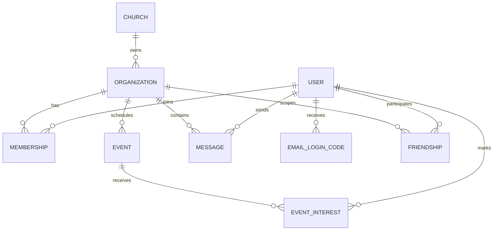

_This project has been created as part of the 42 curriculum by txavier._

# Claris

## Description

Claris is a full-stack community and church management platform created for the 42 curriculum.
It combines a public-facing site with a private dashboard so organizations can manage users, memberships, events, chat, and authentication in one place.

The project focuses on a production-style architecture with a modern frontend, a modular backend, a relational database, secure authentication, and real-time communication.
Its main features include:

- Multi-tenant organization and membership management.
- Email/password authentication and Google OAuth 2.0 login.
- Two-factor authentication using temporary email codes.
- Real-time chat and activity updates.
- Event creation, editing, and media uploads.
- Multilingual support, accessibility improvements, and PWA support.
- Dark/light theme support and reusable design-system components.
- A Swagger-documented public API protected by an API key.


## Instructions

### Prerequisites

- Docker 24+ and Docker Compose v2.
- Node.js 22+ if you want to run the apps without Docker.
- A root `.env` file based on `.env.example`.
- Valid credentials for the external services used by the project when you want the full authentication and media flow:
  - Google OAuth client ID and secret.
  - Resend API key and sender email.
  - Cloudinary account credentials.

### Recommended setup with Docker

1. Copy the example environment file to the repository root.

   ```bash
   cp .env.example .env
   ```

2. Review the values in `.env` and adjust them if you are deploying outside the local development environment.
3. Start the full stack.

   ```bash
   make up
   # or
   docker compose up -d --build
   ```

4. Open the frontend in your browser:
   - `http://localhost:3000`
5. Access the backend API:
   - `http://localhost:3001/api/v1`
6. Open the public Swagger documentation:
   - `http://localhost:3001/public/docs`
7. Open Prisma Studio if you need to inspect the database:

   ```bash
   make studio
   ```

8. Stop the stack when you are done:

   ```bash
   make down
   ```

### Useful Makefile commands

- `make logs` to follow all service logs.
- `make logs-frontend` to inspect frontend logs only.
- `make logs-backend` to inspect backend logs only.
- `make psql` to open a PostgreSQL shell inside the database container.
- `make migrate` to force Prisma migrations inside the backend container.
- `make seed` to populate the database with seed data.
- `make down-volumes` to stop the stack and remove the database volume.

### Local development without Docker

If you prefer to run each app manually, use Node.js 22+.

Backend:

```bash
cd claris-backend
npm install
npm run start:dev
```

Frontend:

```bash
cd claris-frontend
npm install
npm run dev
```

## Database Schema

The database is centered on organizations and the people who belong to them.
The main relationships are:

- One Church has many Organizations.
- One Organization has many Memberships, Events, Messages, and Friendships.
- One User can belong to many Organizations through Membership.
- One User can attend many Events through EventInterest.
- One User can send and receive Messages.
- One User can receive temporary EmailLoginCode records for authentication.
- One Friendship links two Users inside a specific Organization.



## Resources

Classic references used for the project:

- 42 ft_transcendence subject.
- Next.js documentation: https://nextjs.org/docs
- React documentation: https://react.dev/
- NestJS documentation: https://docs.nestjs.com/
- Prisma documentation: https://www.prisma.io/docs
- PostgreSQL documentation: https://www.postgresql.org/docs/
- Docker documentation: https://docs.docker.com/
- Docker Compose documentation: https://docs.docker.com/compose/
- Socket.IO documentation: https://socket.io/docs/
- Passport documentation: https://www.passportjs.org/
- MDN Web Docs: https://developer.mozilla.org/
- WCAG 2.1 overview: https://www.w3.org/TR/WCAG21/
- Cloudinary documentation: https://cloudinary.com/documentation
- Resend documentation: https://resend.com/docs

AI usage:

- AI was used to structure the README into the sections required by the 42 curriculum.
- AI was used to translate and refine the wording into English.
- AI was used to map the implementation notes from the codebase into readable team, feature, module, and contribution summaries.
- AI was not used to invent features or claim work that is not present in the repository; the final text was aligned with the existing codebase and team notes.

## License and Credits

This project was developed for educational purposes as part of the 42 curriculum.
