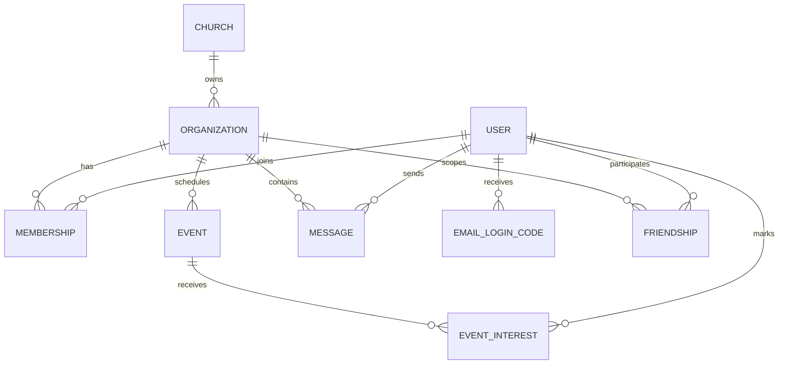

_This project has been created as part of the 42 curriculum by ateca, cgouveia, dcaliqui, txavier._

# Claris

## Description

Claris is a full-stack community and church management platform created for the 42 curriculum.
It combines a public-facing site with a private dashboard so organizations can manage users, memberships, events, chat, and authentication in one place.

The project focuses on a production-style architecture with a modern frontend, a modular backend, a relational database, secure authentication, and real-time communication.
Its main features include:

- Multi-tenant organization and membership management.
- Email/password authentication and Google OAuth 2.0 login.
- Two-factor authentication using temporary email codes.
- Real-time chat and activity updates.
- Event creation, editing, and media uploads.
- Multilingual support, accessibility improvements, and PWA support.
- Dark/light theme support and reusable design-system components.
- A Swagger-documented public API protected by an API key.

## Instructions

### Prerequisites

- Docker 24+ and Docker Compose v2.
- Node.js 22+ if you want to run the apps without Docker.
- A root `.env` file based on `.env.example`.
- Valid credentials for the external services used by the project when you want the full authentication and media flow:
  - Google OAuth client ID and secret.
  - Resend API key and sender email.
  - Cloudinary account credentials.

### Recommended setup with Docker

1. Copy the example environment file to the repository root.

   ```bash
   cp .env.example .env
   ```

2. Review the values in `.env` and adjust them if you are deploying outside the local development environment.
3. Start the full stack.

   ```bash
   make up
   # or
   docker compose up -d --build
   ```

4. Open the frontend in your browser:
   - `http://localhost:3000`
5. Access the backend API:
   - `http://localhost:3001/api/v1`
6. Open the public Swagger documentation:
   - `http://localhost:3001/public/docs`
7. Open Prisma Studio if you need to inspect the database:

   ```bash
   make studio
   ```

8. Stop the stack when you are done:

   ```bash
   make down
   ```

### Useful Makefile commands

- `make logs` to follow all service logs.
- `make logs-frontend` to inspect frontend logs only.
- `make logs-backend` to inspect backend logs only.
- `make psql` to open a PostgreSQL shell inside the database container.
- `make migrate` to force Prisma migrations inside the backend container.
- `make seed` to populate the database with seed data.
- `make down-volumes` to stop the stack and remove the database volume.

### Local development without Docker

If you prefer to run each app manually, use Node.js 22+.

Backend:

```bash
cd claris-backend
npm install
npm run start:dev
```

Frontend:

```bash
cd claris-frontend
npm install
npm run dev
```

## Project Management

The team organized the work by ownership area and integrated the pieces through short syncs and shared reviews.
Each member took primary responsibility for one domain while still reviewing adjacent work to keep the experience consistent across frontend, backend, and database layers.

Tools and coordination:

- GitHub was used for source control and task coordination.
- The repository-level Makefile and Docker Compose setup were used to keep the development workflow reproducible.
- Swagger and Prisma Studio were used during implementation to validate the API and inspect the data model.

Communication:

- Day-to-day coordination happened through direct team communication and regular check-ins.
- Technical decisions were aligned before implementation to avoid duplicated work and conflicting patterns.

## Team Information

| Member | Login | Role(s) | Responsibilities |
| --- | --- | --- | --- |
| Damásio Caliqui | dcaliqui | Product Owner | Frontend ownership, real-time UX, user communication, activity notifications, SSR, reusable UI building blocks, and user-management flows. |
| Chingi | mchingi | Project Manager / Scrum Master | Accessibility (WCAG 2.1 AA), keyboard navigation, assistive-technology support, i18n, additional browser support, and PWA delivery. |
| António Teca | ateca | Technical Lead | NestJS/Prisma project configuration, private API design, business rules, and CRUD implementation. |
| Tchiadi Xavier | txavier | Developer | Google OAuth 2.0 authentication and two-factor authentication. |
| Costantino Gouveia | cgouveia | Developer | Prisma schema design, dark/light theme support, and public API implementation. |

## Technical Stack

### Frontend

- Next.js 16 with the App Router.
- React 19 and TypeScript.
- Tailwind CSS 4 for styling.
- next-themes for theme switching.
- Zustand for client-side state.
- Socket.IO client for real-time communication.
- Radix UI and Lucide for accessible and consistent UI primitives and icons.
- Zod and react-phone-number-input for form validation and input handling.

Why these choices:

- Next.js gives server-side rendering, routing, metadata, and a clean production deployment model.
- React and TypeScript keep the UI predictable and maintainable.
- Tailwind and Radix UI make it easier to build reusable, accessible components quickly.
- Zustand and Socket.IO fit the dashboard-style, real-time workflows used in the project.

### Backend

- NestJS 11 with TypeScript.
- Prisma ORM with PostgreSQL 16.
- Socket.IO for WebSockets.
- Passport with JWT, local, and Google strategies.
- bcrypt for password hashing.
- Cloudinary for media uploads.
- Resend for email delivery.
- Swagger for API documentation.

Why these choices:

- NestJS provides a modular backend architecture that matches the project size and team structure.
- Prisma makes the database layer type-safe and easier to evolve.
- PostgreSQL is a good fit for the relational data model: users, memberships, organizations, events, friendships, messages, and verification codes.
- Socket.IO is used where low-latency live updates matter.
- Cloudinary and Resend keep media and email concerns isolated from the core business logic.

### Infrastructure

- Docker and Docker Compose for a reproducible local environment.
- Node.js 22 in both Docker images.
- PostgreSQL as the persistence layer.

## Database Schema

The database is centered on organizations and the people who belong to them.
The main relationships are:

- One Church has many Organizations.
- One Organization has many Memberships, Events, Messages, and Friendships.
- One User can belong to many Organizations through Membership.
- One User can attend many Events through EventInterest.
- One User can send and receive Messages.
- One User can receive temporary EmailLoginCode records for authentication.
- One Friendship links two Users inside a specific Organization.



### Key tables

| Table | Key fields | Purpose |
| --- | --- | --- |
| User | `email`, `displayName`, `passwordHash`, `googleId`, `avatarUrl`, `lastSeen` | Stores account and profile information. |
| Church | `name`, `createdAt` | Represents the top-level church entity. |
| Organization | `churchId`, `name`, `slug`, `address`, `description`, `logoUrl` | Stores each organization inside a church. |
| Membership | `userId`, `organizationId`, `role`, `joinedAt` | Links a user to an organization and stores the member role. |
| Event | `organizationId`, `title`, `description`, `date`, `location`, `photoUrl` | Stores organization events. |
| EventInterest | `eventId`, `userId`, `createdAt` | Tracks interest in an event. |
| Message | `senderId`, `recipientId`, `organizationId`, `content`, `readAt` | Stores chat messages and read state. |
| Friendship | `organizationId`, `userAId`, `userBId`, `createdById` | Stores member-to-member relationships inside an organization. |
| EmailLoginCode | `userId`, `codeHash`, `expiresAt`, `usedAt` | Stores temporary login verification codes. |

## Features List

| Feature | Description | Main contributors |
| --- | --- | --- |
| Public landing page and marketing site | Responsive homepage, support pages, legal pages, and SEO metadata. | dcaliqui, mchingi |
| Authentication flow | Email/password login, Google OAuth, token-based access, and organization selection. | txavier, ateca |
| Two-factor authentication | Temporary email codes for login verification. | txavier, ateca |
| Organization and membership management | Organization creation, member roles, tenant scoping, and membership handling. | ateca, cgouveia |
| Real-time chat | Live messaging, unread counts, and WebSocket synchronization. | dcaliqui, ateca |
| Event management | Create, edit, list, and delete events, including image uploads and interest tracking. | ateca, cgouveia |
| User management | Profile updates, password changes, avatar handling, and account cleanup. | dcaliqui, ateca |
| Theme system | Dark/light mode with reusable design tokens. | cgouveia |
| Internationalization | Three-language support with locale-aware routing and translated content. | mchingi |
| Accessibility and PWA | Keyboard-friendly UI, assistive-technology support, manifest, offline support, and installability. | mchingi |
| Public API | API-key-protected public endpoints documented with Swagger. | cgouveia, ateca |

## Modules

The table below groups the implemented work into Major and Minor modules for clarity.
Major modules are counted as 2 points each and Minor modules as 1 point each.

| Module | Type | Points | Implementation | Main contributors |
| --- | --- | --- | --- | --- |
| Google OAuth 2.0 login | Major | 2 | Implemented with Passport GoogleStrategy, callback handling, and JWT handoff after successful authentication. | txavier, ateca |
| Two-factor authentication | Major | 2 | Implemented with temporary login codes stored in Prisma and validated before the final session is issued. | txavier, ateca |
| Real-time chat | Major | 2 | Implemented with a NestJS WebSocket gateway and a Socket.IO client in the dashboard. | dcaliqui, ateca |
| Multi-tenant organization access | Major | 2 | Implemented with tenant-aware middleware, organization selection, and membership-scoped queries. | ateca |
| Dark/light theme | Minor | 1 | Implemented with next-themes and a client-side theme toggle. | cgouveia |
| Internationalization | Minor | 1 | Implemented with locale routing and translated dictionaries for the public and private UI. | mchingi |
| PWA support | Minor | 1 | Implemented with a web manifest, service worker, and client-side registration. | mchingi |
| Accessibility | Minor | 1 | Implemented with semantic markup, keyboard navigation, ARIA-friendly controls, and visible focus states. | mchingi |
| Public API and Swagger docs | Minor | 1 | Implemented with API-key protection and generated documentation for public endpoints. | cgouveia, ateca |

Total: 13 points.

## Individual Contributions

### Damásio Caliqui (dcaliqui)

- Led the frontend experience and helped shape the public-facing interface.
- Built or integrated real-time UI behaviors, user communication surfaces, and activity notifications.
- Worked on SSR-driven pages, reusable components, palette consistency, typography, and icon usage.
- Contributed to user-management flows on the frontend.

Challenges and approach:

- Keeping the UI consistent across many pages was handled by reusing layout components and shared design tokens.
- Real-time feedback required careful state synchronization so the dashboard stayed responsive without overcomplicating the component tree.

### Chingi (mchingi)

- Managed the project workflow as Scrum Master.
- Implemented accessibility improvements aligned with WCAG 2.1 AA.
- Ensured keyboard navigation and assistive-technology support across the interface.
- Added multilingual support for the system and helped extend browser compatibility.
- Contributed to the PWA implementation.

Challenges and approach:

- Accessibility was addressed by using semantic HTML, correct focus handling, and ARIA-friendly patterns.
- Locale switching was kept predictable by centralizing message dictionaries and locale-aware routing.

### António Teca (ateca)

- Acted as Technical Lead and configured the NestJS/Prisma backend foundation.
- Built the private API layer and the core business rules.
- Implemented CRUD flows across the backend modules.
- Helped align authentication, tenancy, and domain constraints.

Challenges and approach:

- Multi-tenant data isolation was handled through middleware, guards, and query scoping.
- Validation and maintainability were improved with DTOs, service boundaries, and Prisma relations.

### Tchiadi Xavier (txavier)

- Implemented Google OAuth 2.0 authentication.
- Implemented two-factor authentication using email verification codes.
- Helped connect the login flow between the frontend and backend.

Challenges and approach:

- Handling partial login states required a staged authentication flow with temporary tokens and code verification.
- The final login logic was kept secure by separating the temporary code step from the final JWT issuance.

### Costantino Gouveia (cgouveia)

- Designed the Prisma schema and the relational model.
- Implemented dark/light mode support.
- Helped build the public API.

Challenges and approach:

- The schema had to support organizations, memberships, chat, events, and authentication without becoming brittle; this was solved with explicit relations, constraints, and indexes.
- Theme handling was kept simple by centralizing the theme switch in a shared provider and toggle component.

## Resources

Classic references used for the project:

- 42 ft_transcendence subject.
- Next.js documentation: https://nextjs.org/docs
- React documentation: https://react.dev/
- NestJS documentation: https://docs.nestjs.com/
- Prisma documentation: https://www.prisma.io/docs
- PostgreSQL documentation: https://www.postgresql.org/docs/
- Docker documentation: https://docs.docker.com/
- Docker Compose documentation: https://docs.docker.com/compose/
- Socket.IO documentation: https://socket.io/docs/
- Passport documentation: https://www.passportjs.org/
- MDN Web Docs: https://developer.mozilla.org/
- WCAG 2.1 overview: https://www.w3.org/TR/WCAG21/
- Cloudinary documentation: https://cloudinary.com/documentation
- Resend documentation: https://resend.com/docs

AI usage:

- AI was used to structure the README into the sections required by the 42 curriculum.
- AI was used to translate and refine the wording into English.
- AI was used to map the implementation notes from the codebase into readable team, feature, module, and contribution summaries.
- AI was not used to invent features or claim work that is not present in the repository; the final text was aligned with the existing codebase and team notes.

## License and Credits

This project was developed for educational purposes as part of the 42 curriculum.
